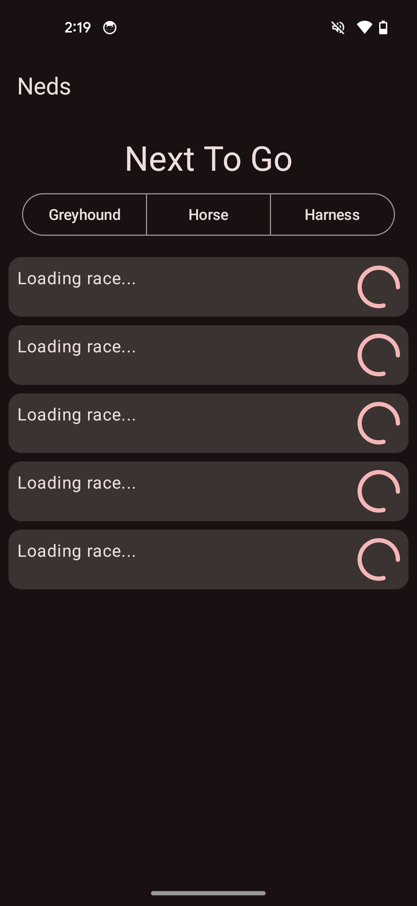
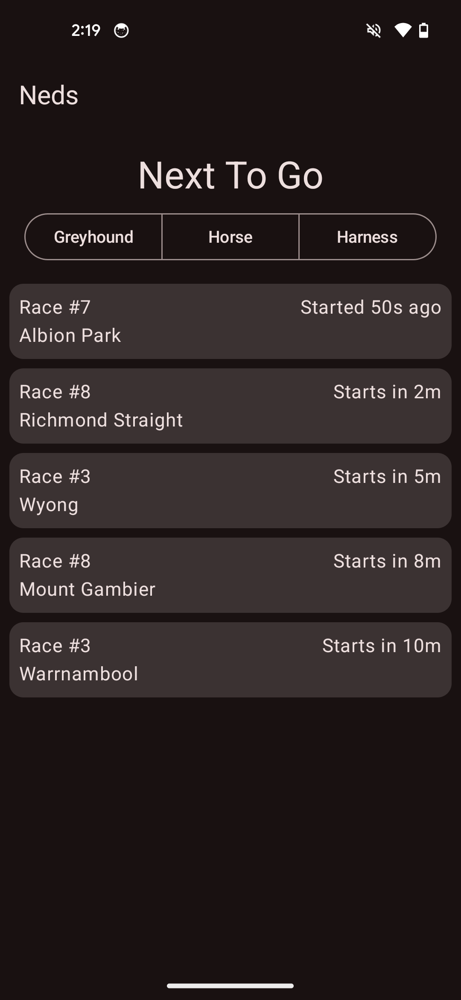
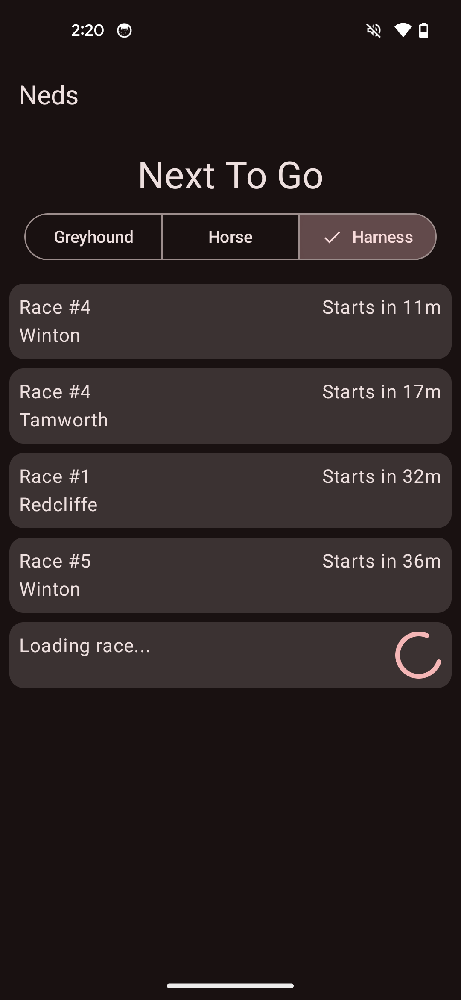
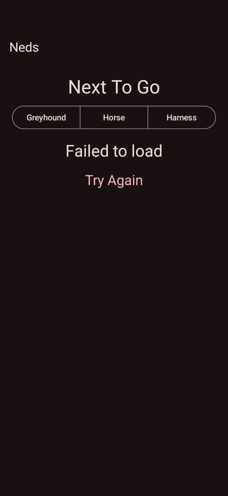

# Next To Go

The Next To Go screen shows a list of upcoming racing events.

It currently has 3 categories: Greyhound, Horse, and Harness racing.

This screen will show exactly 5 upcoming events at a time, sorted by the starting time of the event.

Events will stay on the screen for 60 seconds after they have started. After that, they will automatically be removed from the screen and replaced with a new event.

## Initial load

When the app first starts up, it will display 5 races in a loading state.

During this time it will query the racing API for some upcoming races via a HTTPS request.

## Successful load

If the races are loaded successfully, they will display on the screen sorted by their start time.

Up the top left of each card is the race number.

Up the top right is the time remaining until the race begins, or how long ago the race already began. The time will automatically update every second.

At the bottom left is the name of the meeting.

## Partial load

The Next To Go screen always tries to display 5 races.

In some cases, however, there may not be enough races to display.

For example, this may happen if you leave the screen running, and races continue to pass by until you no longer have enough upcoming races to display.

Or it could be that you've filtered by a category without many upcoming races.

In that situation, the screen will display a mix of races and loading cards.

In the background, the app will download progressively more races from the Neds API (up to 100 races at a time maximum) until it retrieves enough races to display the required number of races.

If it reaches 100 races downloaded and still doesn't have enough to display, it will stop downloading more races and try again in 1 minute.

## Failed to load

If the app cannot download any races for some reason, it will display an error screen.

This screen contains a single Try Again button, which can be pressed to try downloading more races.

This error may occur if you have internet connectivity issues, or there is an issue with the Neds API server.

